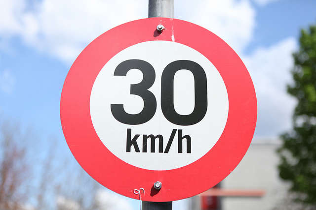
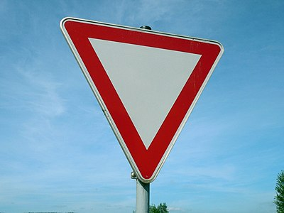

# **Traffic Sign Recognition** 

---

**Build a Traffic Sign Recognition Project**

The goals / steps of this project are the following:
* Load the data set (see below for links to the project data set)
* Explore, summarize and visualize the data set
* Design, train and test a model architecture
* Use the model to make predictions on new images
* Analyze the softmax probabilities of the new images
* Summarize the results with a written report

**Rubric Points: Here I will consider the [rubric points](https://review.udacity.com/#!/rubrics/481/view) individually and describe how I addressed each point in my implementation.**  

---

## Data Set Summary & Exploration

### 1. Provide a basic summary of the data set. In the code, the analysis should be done using python, numpy and/or pandas methods rather than hardcoding results manually.

I used the pandas library to calculate summary statistics of the traffic
signs data set:

* The size of training set is 34799
* The size of the validation set is 
* The size of test set is 12630
* The shape of a traffic sign image is (32, 32, 3)
* The number of unique classes/labels in the data set is 43

### 2. Include an exploratory visualization of the dataset.

Here is an exploratory visualization of the data set. Count of each sign:

{0: 180, 1: 1980, 2: 2010, 3: 1260, 4: 1770, 5: 1650, 6: 360, 7: 1290, 8: 1260, 9: 1320, 10: 1800, 11: 1170, 12: 1890, 13: 1920, 14: 690, 15: 540, 16: 360, 17: 990, 18: 1080, 19: 180, 20: 300, 21: 270, 22: 330, 23: 450, 24: 240, 25: 1350, 26: 540, 27: 210, 28: 480, 29: 240, 30: 390, 31: 690, 32: 210, 33: 599, 34: 360, 35: 1080, 36: 330, 37: 180, 38: 1860, 39: 270, 40: 300, 41: 210, 42: 210}

Randomly sign visualization:
```python
index = random.randint(0, len(X_train))
image = X_train[index].squeeze()
plt.figure(figsize=(1,1))
plt.imshow(image)
print(y_train[index])
```

![alt text][image1]

## Design and Test a Model Architecture

### 1. Processing
- **convert RGB images into grayscale**
The reason of converting grayscale is, when CNN extracts each feature map, it actually avoids the color channels. The result also turns out that converting to grayscale can generate higher validation / test accuracy.
```python
x_gray = np.dot(x[...,:3], [0.299, 0.587, 0.114])
x_gray = np.expand_dims(x_gray, axis=3) # the output will still have color channel = 1
```
- **normalize data**
Since our input data has different value and distribution, which will cause some issue when we do gradient dencent, with same learning rate. Thus, normalization is important.
```python
x_norm = (x_gray - 128) / 128
```
### 2. Model Architecture
* Type of Model: CNN
* Layers Details:
#### Input
The LeNet architecture accepts a 32x32x3 image as input.
#### Architecture
**Layer 1: Convolutional.** Input = 32x32x1. Output = 28x28x30.

**Activation.** Activation relu.

**Pooling.** Input = 28x28x30. Output = 14x14x30.

**Layer 2: Convolutional.** Output = 10x10x60.

**Activation.** Activation relu.

**Pooling.** Input = 10x10x60. Output = 5x5x60.

**Flatten.** Input = 5x5x60. Output = 1500.

**Layer 3: Fully Connected.** Fully Connected. Input = 1500. Output = 300.

**Activation.** Activation relu.

**Dropout.** dropout = 0.75

**Layer 4: Fully Connected.** Input = 300. Output = 150.

**Activation.** Activation relu.

**Dropout.** dropout = 0.75

**Layer 5: Fully Connected (Logits).** This should have 43 outputs.

### 3. Model Training
The network was using AdamOptimizer to minimize the cost. Epoch number is 60, Batch Size is 64. The learning rate is 0.001.
Code is shown below:
```python
rate = 0.001

logits = LeNet(x)
cross_entropy = tf.nn.softmax_cross_entropy_with_logits(labels=one_hot_y, logits=logits) # error between logits and labels
loss_operation = tf.reduce_mean(cross_entropy) # average the cross entropy (cost function)
optimizer = tf.train.AdamOptimizer(learning_rate = rate) # similar as gradient decent, to minimize cost function 
training_operation = optimizer.minimize(loss_operation) # use BP to update network and minimize the training loss
```

### 4. Solution Approach
In each epoch, feed in number of batch size of training data each time and train the model. When all training data has been used, use validation data to validate the current trained model.
When all epochs has been done, use test data to test the model. In my work, final test accuracy is 94.5%.

## Test a Model on New Images

### 1. Choose five German traffic signs found on the web and provide them in the report. For each image, discuss what quality or qualities might be difficult to classify.

Here are five German traffic signs that I found on the web:

  
 

The image label class dictionary is: 
```python
label_dict = {'roadwork.jpg':25, 'sp30.jpg':1, 'sp70.jpg':4, 'Stop.jpg':14, 'yield.jpg':13}
```
Based on the count of each class of training dataset, roadwork has 1350 samples, speed limit 30 has 1980 samples, speed limit 70 has 1770 samples, stop sign has 690 samples, yield sign has 1920 samples. 

Since I did not balance the training classes by adding some fake data, I guess, stop sign is very likely to be wrong detected.

### 2. Discuss the model's predictions on these new traffic signs and compare the results to predicting on the test set.

Here are the results of the prediction:

| Image			        |     Prediction	        					| 
|:---------------------:|:---------------------------------------------:| 
| RoadWork      		| RoadWork   									| 
| SpeedLmt30     		| Roundabout mandatory 							|
| SpeedLmt70			| SpeedLmt70									|
| stop sign				| stop sign					 					|
| yield sign			| yield sign									|


The model was able to correctly classify 4 of the 5 traffic signs, which gives an accuracy of 80%. This is not as good as test result using German traffic sign test dataset.

### 3. Describe how certain the model is when predicting on each of the five new images by looking at the softmax probabilities for each prediction. Provide the top 5 softmax probabilities for each image along with the sign type of each probability. (OPTIONAL: as described in the "Stand Out Suggestions" part of the rubric, visualizations can also be provided such as bar charts)

For the first image, the model is relatively sure that this is a speed limit 70 (probability of 1.0), and the image does contain a speed limit 70. The top five soft max probabilities were

| Probability         	| Prediction     								| 
|:---------------------:|:---------------------------------------------:| 
| 1.00					| speed limit 70								| 
| 0.00     				| Speed limit 20								|
| 0.00					| Speed limit 30								|
| 0.00					| Speed limit 50				 				|
| 0.00				    | Speed limit 60								|


For the second image, the model is relatively sure that this is a Road work (probability of 1.0), and the image does contain a Road work. The top five soft max probabilities were

| Probability         	| Prediction     								| 
|:---------------------:|:---------------------------------------------:| 
| 1.00					| Road work										| 
| 0.00     				| Wild animals crossing							|
| 0.00					| Keep right									|
| 0.00					| No passing for vehicles over 3.5 metric tons	|
| 0.00					| Slippery road									|

For the third image, the model is relatively sure that this is a Yield (probability of 1.0), and the image does contain a Yield. The top five soft max probabilities were

| Probability         	| Prediction     								| 
|:---------------------:|:---------------------------------------------:| 
| 1.00					| Yield											| 
| 0.00     				| Speed limit 20								|
| 0.00					| Speed limit 30								|
| 0.00					| Speed limit 50				 				|
| 0.00				    | Speed limit 60								|

For the forth image, the model is relatively sure that this is a Roundabout mandatory (probability of 1.0), and the image does not contain a Roundabout mandatory. The top five soft max probabilities were

| Probability         	| Prediction     								| 
|:---------------------:|:---------------------------------------------:| 
| 1.00					| Roundabout mandatory							| 
| 3.08385723e-14		| General caution								|
| 6.83437864e-17		| Keep right									|
| 1.02109006e-29		| No entry				 						|
| 9.03987054e-30		| Go straight or left							|

For the fifth image, the model is relatively sure that this is a Stop sign (probability of 0.99), and the image does not contain a Stop sign. The top five soft max probabilities were

| Probability         	| Prediction     								| 
|:---------------------:|:---------------------------------------------:| 
| 0.99					| Stop sign										| 
| 5.82756074e-05		| Speed limit 60								|
| 2.42835654e-06		| Go straight or right							|
| 1.87486773e-06		| Turn right ahead								|
| 9.08689572e-07		| Turn left ahead								|

